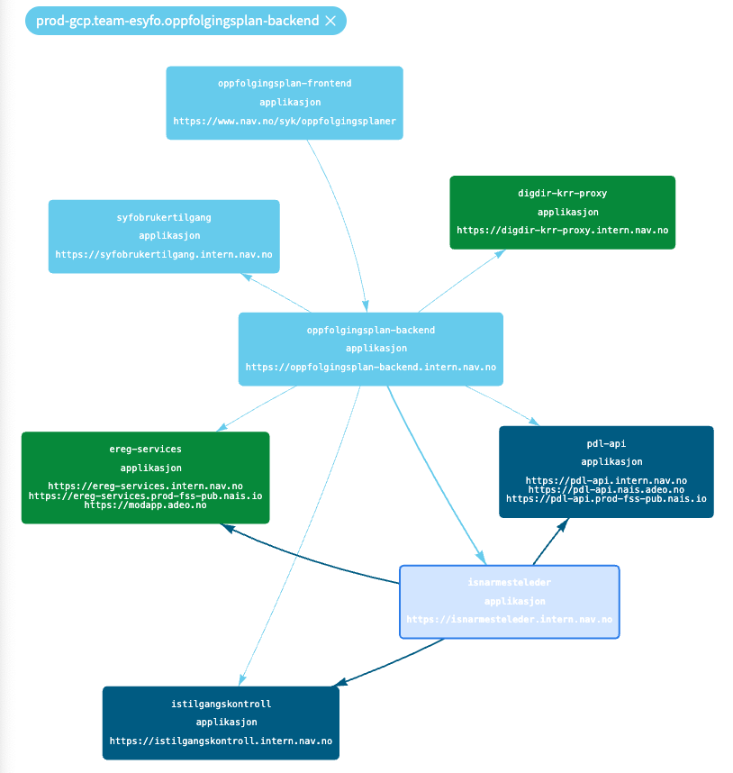

# oppfolgingsplan-backend
Backend for storing and processing "oppfølgingsplaner".

This service has started to absorb and take over functionality from [syfooppfolgingsplanservice](https://github.com/navikt/syfooppfolgingsplanservice)
and it runs in GCP.

The work to fully replace syfooppfolgingsplanservice was halted due to migration difficulties and a functional desire
to change how oppfølgingsplaner is made.

## Dependencies on and by other applications

The image was taken 2024.05.14. An up-to-date representation is always available using
[flex-arkitektur](https://flex-arkitektur.intern.dev.nav.no/?apper=prod-gcp.team-esyfo.oppfolgingsplan-backend&namespace=team-esyfo)